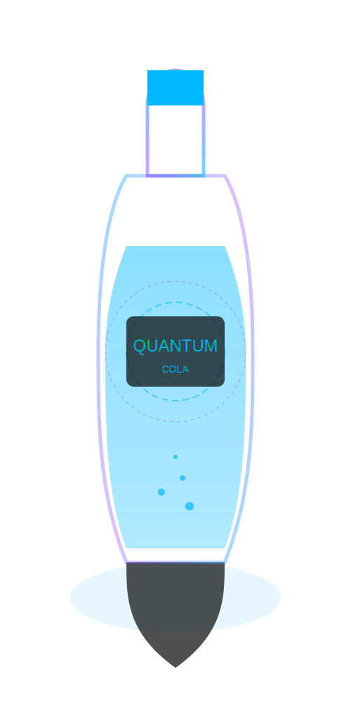

# SVG Implementation Guide for Coca-Cola Future Website

## Overview
This guide outlines the SVG implementation for the futuristic Coca-Cola website. We've created SVG placeholders for all required images, which can be replaced with high-quality production images when ready.

## Current Implementation

### Core Brand Images
- `coca-cola-future-logo.svg` - Futuristic Coca-Cola logo with glowing blue effects
- `favicon.svg` - Simplified Coca-Cola icon with glowing effects for browser tabs

### Hero Section
- `future-bottle.svg` - Futuristic Coca-Cola bottle with holographic elements for the main hero section

### Product Images
- `quantum-cola.svg` - The reimagined classic with blue glowing accents
- `zero-gravity.svg` - Zero Sugar futuristic variant with anti-gravity bubbles
- `bio-energy.svg` - Energizing variant with bioluminescent green accents
- `nebula-fusion.svg` - Multi-colored nebula-themed variant

### Evolution Timeline Images
- `evolution.svg` - Timeline header image showing Coca-Cola's evolution
- `evolution-1886.svg` - Original Coca-Cola Formula from 1886
- `evolution-1916.svg` - The iconic contour bottle introduction from 1916
- `evolution-1985.svg` - New Coke formula launch from 1985
- `evolution-2025.svg` - Quantum-infused formula concept for 2025
- `evolution-2040.svg` - Neural integration concept for 2040

### Additional Images
- `2fa-qr-placeholder.svg` - QR code for two-factor authentication in the settings section

## Replacing SVG Placeholders

### Method 1: PNG Replacement
1. Create high-quality PNG images for each SVG placeholder
2. Replace the SVG references in the HTML with PNG equivalents
3. Update the JavaScript file to reference PNG files instead of SVGs

Example:
```html
<!-- From -->

<!-- To -->

```

### Method 2: SVG Enhancement
1. Retain the SVG format but enhance the designs with more detailed elements
2. Add more complex animations to the existing SVGs
3. Optimize the SVGs for performance using tools like SVGO

## Design Guidelines

### Color Palette
- Primary Blue: #00b8ff
- Accent Pink: #ff006c
- Accent Purple: #7000ff
- Dark Background: #080808

### Image Specifications
- Product Images: 400px × 800px
- Logo: 200px × 50px
- Favicon: 32px × 32px
- Timeline Images: 400px × 300px

### Visual Style
- Futuristic, sleek design with glowing effects
- Holographic elements and particle effects
- Glass-like transparency for bottles
- Modern, clean lines with dynamic elements

## Implementation Steps

### Professional Photography/3D Rendering
1. Create 3D models of the bottles in software like Blender or Cinema 4D
2. Apply appropriate materials, lighting, and effects
3. Render images at high resolution
4. Post-process in Photoshop to add glowing effects
5. Export as PNG with transparency or enhanced SVGs

### AI Image Generation
1. Use AI tools like Midjourney or DALL-E with specific prompts
2. Request futuristic Coca-Cola bottles with appropriate styling
3. Refine outputs with additional prompts for better quality
4. Edit the results in image editing software
5. Export in the appropriate format (PNG or SVG)

### Digital Illustration
1. Create vector illustrations in Adobe Illustrator or similar software
2. Use gradient meshes for realistic bottle shapes
3. Add glowing effects with outer glow layer styles
4. Use clipping masks for holographic elements
5. Export as SVG or PNG with transparency

## Quality Assurance
- Test images at various screen sizes to ensure responsiveness
- Check loading performance, especially for complex SVGs
- Ensure accessibility by providing appropriate alt text
- Verify visual consistency across all images

## Additional Resources
- Reference the `image-generation-plan.md` file for detailed image specifications
- See `README-IMAGES.md` for original image requirements 